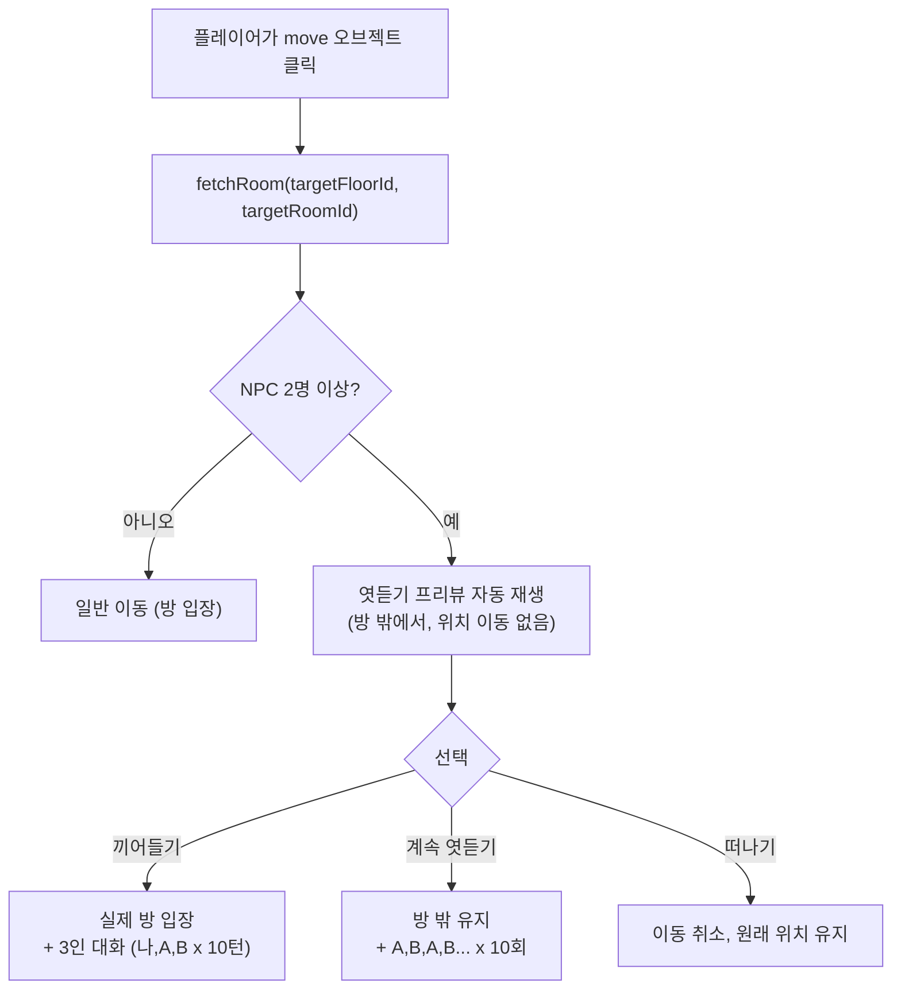

# 엿듣기 로직 재설계

## 문제

현재 엿듣기가 **방 입장 후** 발동됨. 올바른 흐름은 **방 밖에서** 엿듣기가 발동되어야 함.

## HP 소모 규칙

| 행동                       | HP    | 처리 주체                      | 비고                                                     |
| -------------------------- | ----- | ------------------------------ | -------------------------------------------------------- |
| 클릭 조회 (move/item/info) | 1     | **프론트**가 [spendHp(1)](file:///d:/Github/Frontend/src/context/GameContext.jsx#392-431) 전달 | 모든 인터랙션 클릭                                       |
| 1:1 대화                   | 10    | **백엔드** chat API가 차감     | 프론트는 사전 알림만                                     |
| 엿듣기/끼어들기            | 1~10  | **백엔드** chat API가 차감     |                                                          |
| 끼어들기로 방 입장         | **0** | —                              | 엿듣기에서 이미 1HP 소모했으므로 이동 HP 중복 차감 안 함 |

## 올바른 흐름



## 핵심 변경

### handleMove 수정

**현재**: fetchRoom → 이동 → applyRoomPayload → 2인 이상이면 엿듣기  
**변경**: fetchRoom → **2인 이상이면 이동 보류 + 엿듣기 프리뷰** → 선택에 따라 이동/유지

```
handleMove(targetId):
  1. fetchRoom(floorId, targetId)
  2. 요구사항 체크 (열쇠 등)
  3. spendHp(1)  ← 이동 클릭 = 1HP (프론트 전달)
  4. NPC 2명 이상?
     YES → 이동 보류
           → pendingMoveTarget = { floorId, roomId, payload } 저장
           → openEavesdropPreview (방 밖)
           → return (실제 이동은 나중에)
     NO  → executeMove() 바로 실행
```

### 엿듣기 선택 분기

| 선택        | 위치 변경      | HP 추가 | 동작                                                           |
| ----------- | -------------- | ------- | -------------------------------------------------------------- |
| 끼어들기    | **방 입장**    | **0** (중복 방지) | `executeMove()` 후 3인 대화 (나,A,B) 10턴 |
| 계속 엿듣기 | **방 밖 유지** | 백엔드 처리 | A,B,A,B... 10회                                      |
| 떠나기      | **방 밖 유지** | 0 | pendingMoveTarget 클리어                                  |

### 파일 변경

#### [MODIFY] [MainGameScene.jsx](file:///d:/Github/Frontend/src/scenes/MainGameScene.jsx)

1. **[handleMove](file:///d:/Github/Frontend/src/scenes/MainGameScene.jsx#236-293) 수정** — NPC 2인 이상 시 이동 보류, `pendingEavesdropTarget` 저장
2. **`executeMove` 신규** — 실제 이동 로직을 분리 (위치 갱신 + applyRoomPayload)
3. **[handleInterceptChoice](file:///d:/Github/Frontend/src/scenes/MainGameScene.jsx#598-608) 수정** — `executeMove` 호출 후 3인 대화 시작
4. **[handleListenChoice](file:///d:/Github/Frontend/src/scenes/MainGameScene.jsx#687-690) 수정** — 위치 이동 없이 A,B 대화 계속
5. **엿듣기 UI에 "떠나기" 버튼 추가**
6. **`scheduledNpcIds` useMemo 제거** — 서버 API 전용으로 전환

## 검증

- Build 성공 확인
- 2인 NPC 방 이동 시: 엿듣기 프리뷰 → 끼어들기/계속/떠나기 흐름
- 1인/0인 NPC 방: 일반 이동
